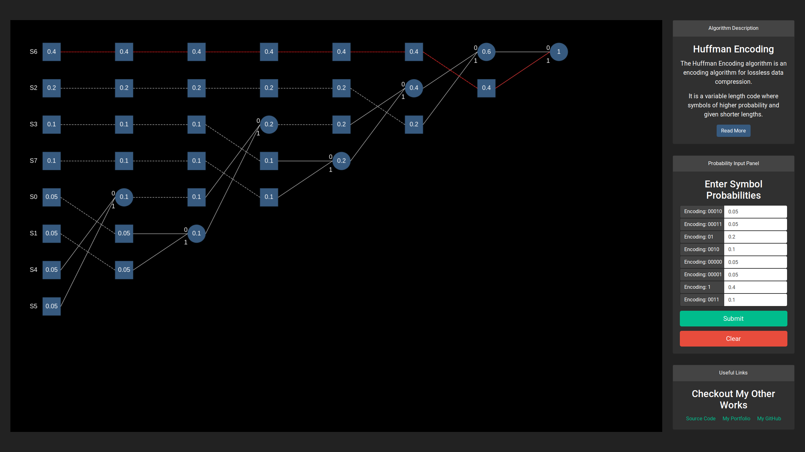

# Huffman-Encoding
A browser-based Huffman encoding visualisation tool.

## Features ##
* User input of up to 8 symbols by probabilities
* Huffman compression algorithm to encode each symbol by a binary string
* Visualisation of the generated Huffman tree using HTML5 Canvas
* Retracing of any user selected path

## TODO ##
* Arbitrary radix encoding
* Accepting more than 8 symbols
* Animations
