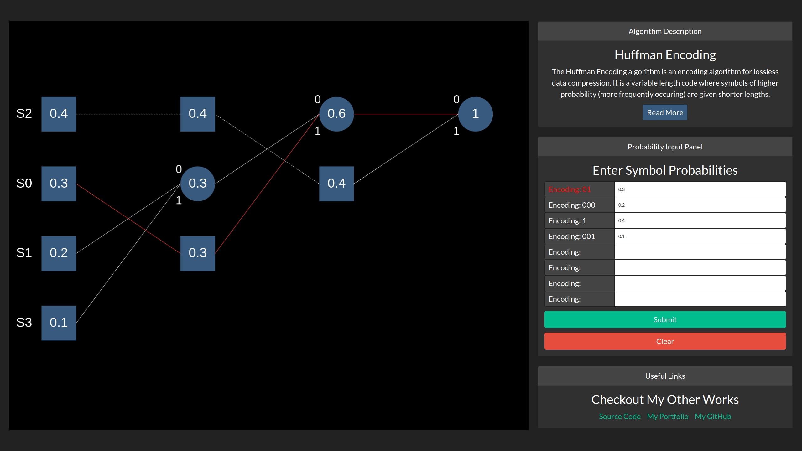

# Huffman-Encoding
A single page web app that generates and renders a binary Huffman tree based on the Huffman encoding algorithm. Implemented in HTML5 Canvas for the core graphics and React + Bootstrap for the remaining control panels.

## Features ##
* User input of up to 8 symbols by probabilities
* Huffman compression algorithm to encode each symbol by a binary string
* Visualisation of the generated Huffman tree using HTML5 Canvas
* Retracing of any user selected path
